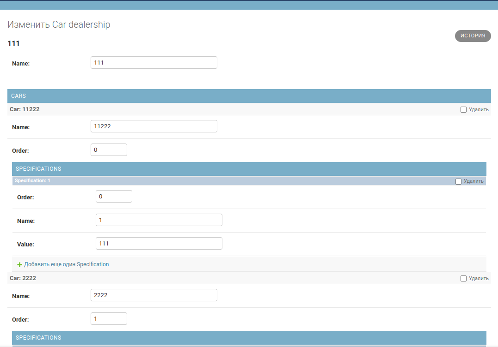
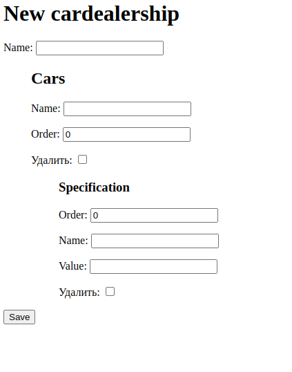

# Nested Form Test
RU: Простая демка пары пакетов для создания вложенных форм в админке и сайте для Django

EN: Simple demo some of python packeges for nested forms in admin area and simple

## Используется / Uses
- Django 4.1
- Python 3.9

## django-nested-admin
https://github.com/theatlantic/django-nested-admin

## django-nested-formset
https://github.com/nyergler/nested-formset

